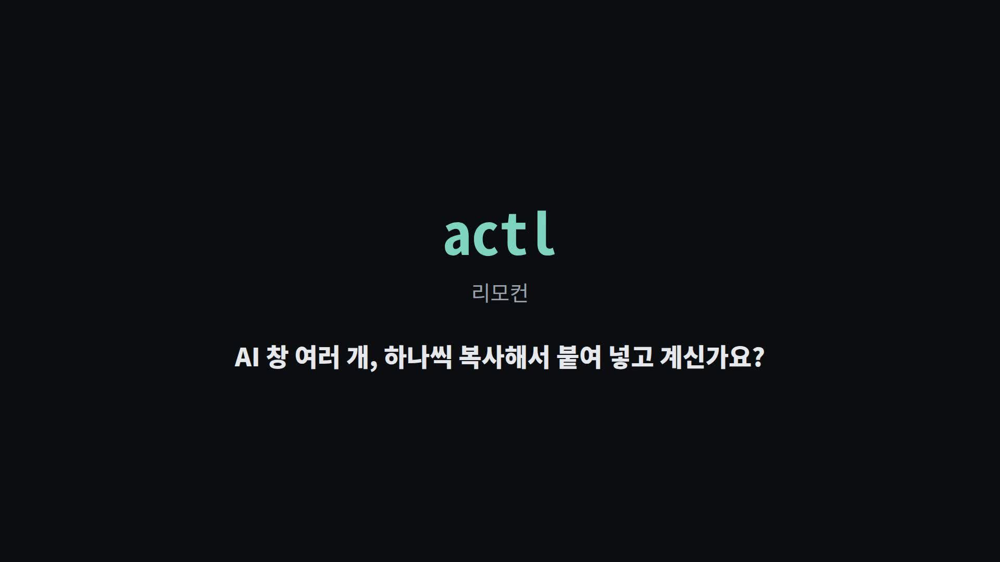

# JuActl

## 한 줄 소개

`actl`은 여러 AI 창에 한 번에 지시를 보내고 답을 받아 복사하는 리모컨입니다.
여러 AI 비서를 번갈아 쓰는 비개발자를 위한 도구입니다.

## 30초 소개 영상

[](docs/media/actl-30s.mp4)

전체 소개 (60초): https://youtu.be/tB1cCLzTvIs

## 지금 되는 것

- **보드:** 실행 중인 AI 창, 연결 상태, 작업 상태, 결과 준비 여부를 한 화면에서 봅니다.
- **전송:** 선택한 창에 여러 줄 지시를 CLI, TUI 또는 웹 보드에서 보냅니다.
- **결과 복사:** 마지막 답을 클립보드로 복사하거나 `--print`로 화면에 출력합니다.
- **창 연결:** `discover`로 tmux 창을 찾고, 확실한 매핑만 `--apply`로 저장합니다.
- **전송 잠금:** 창마다 잠금이 있어 두 전송자가 같은 창에 텍스트를 섞어 보내지 못합니다.
- **운영 기록:** 프롬프트와 답 본문 없이 작업 메타데이터만 로컬 감사 로그에 남깁니다.

## 빠른 시작

AI 창을 먼저 tmux에서 실행한 뒤 저장소 루트에서 실행합니다.

```bash
python3 -m pip install -e .
actl --init
actl doctor
actl discover --apply
actl tui
```

TUI에서 창을 선택하고 `s`로 보내며 `c`로 마지막 답을 복사합니다. 명령줄에서는
다음처럼 사용할 수 있습니다.

```bash
echo "요청 내용" | actl send codex
actl copy codex --print
```

웹 보드는 기본적으로 로컬에서만 열립니다.

```bash
actl serve
```

다른 기기에서 보려면 명시적으로 외부 주소에 바인딩하고 토큰을 사용합니다.
토큰을 직접 정하지 않으면 `actl serve --host <주소>`가 일회성 토큰을 출력하고,
표시된 `?token=...` 주소로 처음 접속합니다. 이후 API 요청은
`Authorization: Bearer <토큰>`으로 인증합니다. 자세한 운영 절차는
[docs/ACTL_OPERATIONS.md](docs/ACTL_OPERATIONS.md)를 참고하세요.

주요 명령은 `actl help`에서 확인할 수 있습니다.

## 다른 프로그램과의 관계

```text
actl (리모컨) → Agent Relay (셋톱박스: PM → Worker → QA) → JuControler (허브: JuPlan · JuCeipt · Tester)
```

`actl`은 AI 창을 조작하고 결과를 가져옵니다. Agent Relay는 승인된 작업을 실행하고,
JuControler는 여러 프로젝트와 도구를 감독합니다.

## 아직 안 되는 것

- AI 프로그램 설치, 로그인, tmux 창 생성은 대신하지 않습니다.
- 연결된 live tmux 창이 없으면 실제 전송과 결과 수집을 할 수 없습니다.
- SSH 터미널이 OSC52 클립보드를 막으면 `--print`로 출력해 수동 복사해야 합니다.
- Windows 설치와 실제 원격 운영은 오프라인 테스트만으로 완료를 보증할 수 없습니다.
- AI의 답변 품질이나 작업 완료를 보증하지 않습니다.

## 점검 명령

저장소에서 릴리즈 전 검사는 다음 명령으로 실행합니다.

```bash
bash scripts/qa.sh
```

Windows 소스/패키지 검사는 PowerShell에서 실행합니다.

```powershell
powershell -ExecutionPolicy Bypass -File scripts/qa.ps1
```

## English summary

JuActl's `actl` is a remote control for people who use several AI assistants.
It shows live panes, sends prompts, and copies the latest result.
Each pane has a send lock so concurrent senders cannot mix text.
It supports CLI, TUI, web board, local tmux, and SSH-routed tmux workflows.
Agent Relay and JuControler sit above it for execution and project supervision.
